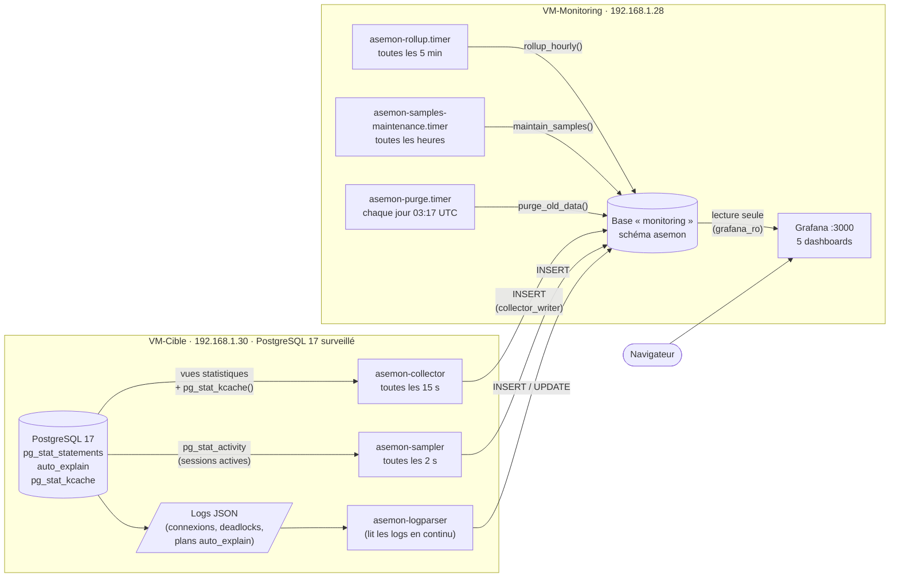
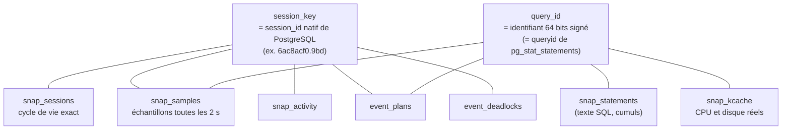
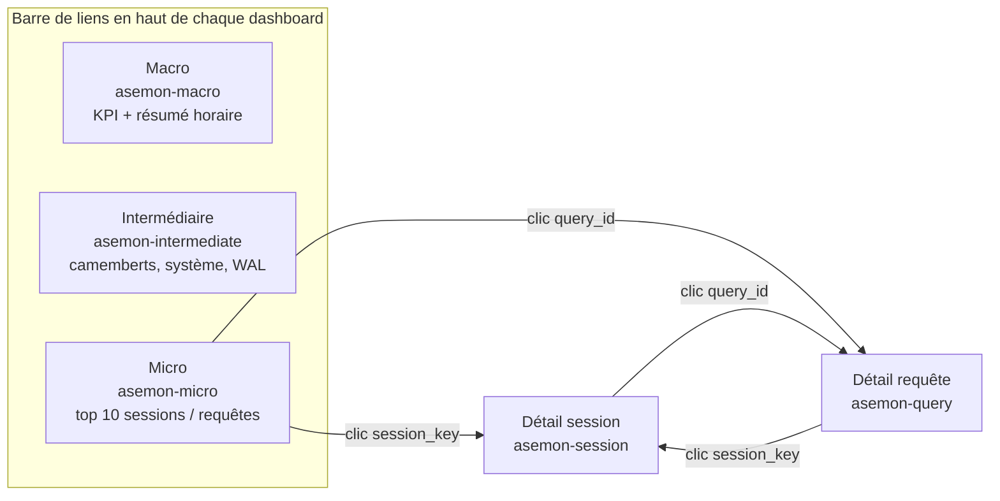

# ASEMON-PG — Architecture

> Vue d'ensemble de l'architecture à la fin des phases 1 à 4. Les diagrammes sont en Mermaid : GitHub les affiche directement.
> Pour l'installation pas à pas, voir l'index des documents dans le `README.md` à la racine du dépôt.

---

## 1. Les deux machines

Rôles PostgreSQL :
- `asemon_collect` (sur VM-Cible) : lecture seule des vues statistiques, utilisé par le collecteur et l'échantillonneur ;
- `collector_writer` (sur VM-Monitoring) : écrit dans le schéma `asemon` ;
- `grafana_ro` (sur VM-Monitoring) : lit le schéma `asemon` et exécute `kcache_attr()`.

Les sessions de ASEMON-PG lui-même (login `asemon_collect`, `application_name` `asemon-*`) sont exclues des dashboards.

---

## 2. Qui alimente quoi

| Composant | Fréquence | Source | Tables alimentées |
|---|---|---|---|
| `collector.py` | 15 s (`INTERVAL`) | vues `pg_stat_*`, `/proc`, `pg_stat_kcache()` | `snap_os`, `snap_activity`, `snap_locks`, `snap_io`, `snap_statements`, `snap_kcache`, `snap_tables`, `snap_indexes`, `snap_checkpoints`, `snap_wal`, `snap_db_age`, `snap_connections` |
| `sampler.py` | 2 s (`SAMPLE_INTERVAL`) | `pg_stat_activity` (sessions actives seulement) | `snap_samples` (partitionnée par jour) |
| `log_parser.py` | en continu | logs JSON de PostgreSQL | `snap_sessions` (connexion et déconnexion exactes), `event_deadlocks`, `event_plans` |
| `rollup_hourly()` | 5 min | `snap_*` bruts | `snap_hourly_summary` (une ligne par heure, jamais purgée) |
| `maintain_samples()` | 1 h | — | crée les partitions à venir de `snap_samples`, supprime les anciennes |
| `purge_old_data()` | 1 j | — | supprime les anciennes lignes des autres tables |

Rétention par défaut (modifiable dans `asemon.settings`, sans redémarrage) :

| Données | Paramètre | Défaut |
|---|---|---|
| `snap_samples` | `sample_retention_days` | 14 jours |
| `snap_*` bruts, `snap_kcache` | `snapshot_retention_days` | 30 jours |
| `event_deadlocks`, `event_plans` | `event_retention_days` | 90 jours |
| `snap_sessions` | `session_retention_days` | 90 jours |
| `snap_hourly_summary` | aucun | illimité |

---

## 3. Les clés qui relient tout

- **`session_key`** est le `session_id` natif de PostgreSQL. Il est présent dans chaque ligne du log JSON et dans `pg_stat_activity`, donc identique partout. Voir `07-sessions-phase1.md`.
- **`query_id`** est identique dans `pg_stat_statements`, `pg_stat_activity`, les plans `auto_explain` des logs et `pg_stat_kcache`. Dans Grafana il est traité comme du **texte** (un entier 64 bits dépasse la précision des nombres JavaScript).
- Les liens sont **logiques**, sans clés étrangères : la purge ne bloque jamais.

---

## 4. Les deux familles de mesures

| | Échantillonné | Mesuré |
|---|---|---|
| Source | `snap_samples` (`pg_stat_activity` toutes les 2 s) | `snap_kcache` (`pg_stat_kcache`, `getrusage`) |
| Donne | temps actif, répartition CPU / I/O / verrous (par type d'attente) | CPU réel (user + system), octets lus et écrits sur disque |
| Précision | approchée : voit les requêtes assez longues, pas les très courtes | exacte par requête et par login |
| Par session ou programme | direct | **réparti** : le coût de chaque cycle est distribué sur les échantillons de même requête, login et base, au prorata de leur durée ; sans échantillon, le coût reste « non attribué » (le total est conservé) |

Fonction de répartition : `asemon.kcache_attr(from, to)`. Détails dans `14-kcache-phase3.md`.

Non mesurable : l'I/O réseau par requête (PostgreSQL ne l'expose pas). Les lectures disque restent à 0 tant que les données tiennent dans le cache de l'OS.

---

## 5. Les dashboards Grafana

Les trois pages macro, intermédiaire et micro sont reliées entre elles par une barre de liens présente sur les cinq dashboards. Le drill-down passe par les clics sur `session_key` et `query_id` (tableaux du micro, exécutions et plans des détails) et conserve la période choisie (`${__url_time_range}`). Le dashboard d'origine (`asemon-dashboard.json`, phase 0) reste disponible : tableaux d'état courant (verrous, index inutilisés, âge des transactions).

| Dashboard | Document |
|---|---|
| Macro | `11-dashboard-macro.md` |
| Intermédiaire | `12-dashboard-intermediaire.md` |
| Micro, détail session, détail requête | `13-dashboard-micro.md` |
| Dashboard d'origine | `05-dashboard-grafana.md` |

---

## 6. Ce qui n'est pas dans le périmètre

- Haute disponibilité du repository, sauvegardes : à traiter hors POC.
- Surveillance de plusieurs instances : le POC en suit une seule (une valeur de `TARGET_DSN`).
- Coûts réseau par requête, et écritures différées (bgwriter, checkpointer) attribuées à une requête : non mesurables.
- Table `snap_query_exec` (une ligne par exécution) : non créée ; une exécution se déduit des échantillons (`session_key`, `query_start`), c'est ce que montrent les dashboards de détail.
